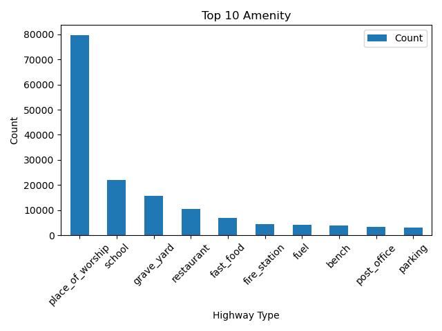
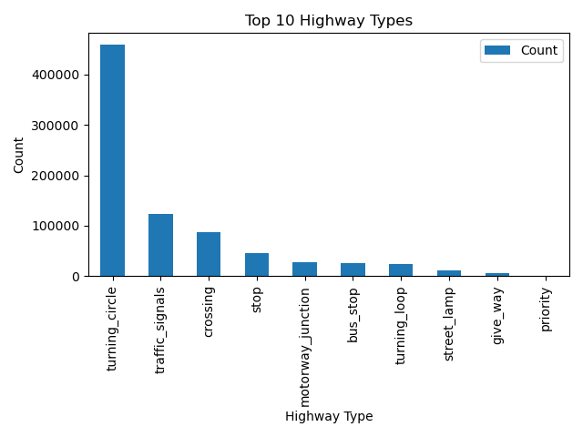

# Project 2: Large-Scale Data Analysis using Hadoop MapReduce

## Overview

This project demonstrates large-scale data processing using Hadoop MapReduce. We analyze OpenStreetMap (OSM) data to extract insights about transportation infrastructure and public amenities in the US South region.

---

## Dataset

* **Source:** OpenStreetMap (Geofabrik)
* **File:** `us-south-260408.osm.pbf`
* **Size:** ~3.7 GB
* **Description:** Contains geographic and infrastructure data including roads, amenities, and other features.

---

## Objective

The goal of this project is to:

* Process large-scale geospatial data using Hadoop MapReduce
* Perform frequency analysis on infrastructure features
* Identify dominant patterns in highway and amenity distributions

---

## Data Preprocessing

The raw `.osm.pbf` file is not directly suitable for Hadoop Streaming, so preprocessing was performed:

1. Filtered relevant tags (`amenity`, `highway`) using `osmium`
2. Exported filtered data to JSON format
3. Converted JSON into line-based text format for Hadoop

Example processed record:

```
highway,motorway_junction
amenity,school
```

---

## Project Structure

```
project2-hadoop-osm/
├── preprocessing/
│   └── convert_osm_stream_v2.py
├── mapreduce/
│   ├── mapper_highway.py
│   ├── mapper_amenity.py
│   └── reducer_count.py
├── results/
│   ├── top10_highway.txt
│   ├── top10_amenity.txt
│   ├── highway_chart.png
│   └── amenity_chart.png
└── README.md
```

---

## MapReduce Implementation

### Mapper (Highway)

Extracts highway types and emits `(type, 1)`

### Mapper (Amenity)

Extracts amenity types and emits `(type, 1)`

### Reducer

Aggregates counts for each key

---

## How to Run

### 1. Start Hadoop Services

```
hdfs --daemon start namenode
hdfs --daemon start datanode
yarn resourcemanager
yarn nodemanager
```

### 2. Upload Input File to HDFS

```
hdfs dfs -mkdir -p /input
hdfs dfs -put sample.txt /input
```

### 3. Run Hadoop Streaming Job

```
hadoop jar $HADOOP_HOME/share/hadoop/tools/lib/hadoop-streaming*.jar \
-input /input/sample.txt \
-output /output_highway \
-mapper "python3 mapper_highway.py" \
-reducer "python3 reducer_count.py" \
-file mapper_highway.py \
-file reducer_count.py
```

---

## Results

### Highway Frequency Analysis

Top highway-related features include:

* crossing
* motorway_junction
* bus_stop

### Amenity Frequency Analysis

Amenity categories show a wide variety of values such as:

* restaurant
* school
* parking
* hospital

---

## Additional Analyses

### Top 10 Comparison

We extracted the top 10 most frequent highway and amenity categories to identify dominant infrastructure patterns.

### Visualization

Bar charts were generated using Python (`matplotlib`) to visualize the frequency distribution.

#### Highway Chart



#### Amenity Chart



---

## Key Insights

* Highway data is dominated by a small number of categories (e.g., crossings and junctions)
* Amenity data follows a long-tail distribution with high diversity
* Transportation features appear more frequent than service-related amenities

---

## Challenges

* Setting up Hadoop on macOS environment
* Handling large-scale `.pbf` data conversion
* Debugging Hadoop Streaming jobs and configuration issues
* Managing memory constraints on a local machine

---

## Conclusion

This project demonstrates the power of Hadoop MapReduce for processing large-scale datasets. The analysis provides insights into infrastructure distribution while highlighting the importance of distributed computing for handling big data.

---

## Author

Ai Tran
